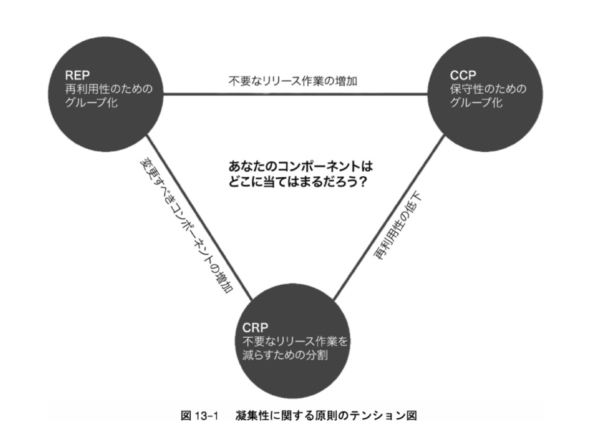

# 1章 設計とアーキテクチャ
- ソフトウェアアーキテクチャの目的は、求められるシステムを構築・保守するために必要な人材を最小限に抑えることである。
- 早く進むことと上手く進むことは片手落ちにしてはならない。

## メモ
- リリースに掛かる時間を早めていくためには？
   - ソフトウェアの品質
   - チームの品質
   - 仕組みの品質
- これら3つを高めていく必要があると考えられる。clean architectureでは主にソフトウェアの品質について議論される。   

# 2章 2つの価値のお話
- ソフトウェアの価値は2つ。
  - 振る舞い
    - ソフトウェアがユーザのニーズを満たすように動く
  - 構造
    - ソフトウェアは「ソフト」「ウェア」である。
    - ウェアはプロダクトという意味。ソフトは変更可能であるという意味。つまり、ソフトウェアは「変更可能性がある、高いプロダクト」という意味である。
- 下のテーブルを見ると
  1. 重要 & 緊急
  2. 重要 & Not緊急
  3. Not重要 & 緊急
  4. Not重要 & Not緊急

という4つのマトリクスがある。優先度は上から順である。3を1としてしまう意思決定が多い。そうしないようにしなければならない。

| |重要|Not重要|
|-|---|----|
|緊急|構造,振る舞い|振る舞い|
|Not緊急|構造|-|

## メモ
- ソフトウェアを「ソフト」であり続けることが大事。そこをビジネスマネージャー(迫さん/高寺さん/奈良岡さん)に主張し続ける必要がある。
- 論理として仕事ナビの売上/利益を上げていくためには多くの変更を施す機能がある。具体的にはLPとか問い合わせ導線とか。または今後新たなに出てくるプロダクトとか。
その変更をしていくためには既存のウェアをソフトにしていく試みが必要になってくる。それができない場合はいずれ仕事ナビは一切変更のできないハードウェアとなってしまうことをちゃんと伝える。
このリファクタリングをどう見積もるのかは大事だろうなぁ。

# 3章 パラダイムの概要
- パラダイムは3つある。
  - 構造化プログラミング
    - 直接的な制御の移行に規律を課すものである。
  - オブジェクト指向プログラミング
    - 間接的な制御の移行に規律を課すものである。      
  - 関数型プログラミング
    - 代入に規律を課すものである。
- プログラミングのパラダイムはソフトウェアアーキテクチャの「コンポーネントの分離」「データ管理」「機能」に関係している。
アーキテクチャの境界を超えるためにポリモーフィズムを使う。
データの配置やアクセスに規律を課すために関数型プログラミングを使う。
モジュールのアルゴリズム基盤として構造化プログラミングを使う。

# 4章 構造化プログラミング
- ソフトウェアは科学的である。つまり、反証可能であるということ。それが正しいことを証明できない。それが間違っていないことを説明はできる。ソフトウェアも同じであり、コードが間違ってないことを説明はできる。が、それが正しいことは証明できない。テストを書いてもそうである。テストはコードが間違っていないことを証明するが、正しいことを証明できない。
- だが、テストは適用できるコードに限りがある。無秩序にgoto文が使われている場合などはほぼテスト不可能である。
なので、機能、コンポーネント、関数、メソッド、オブジェクト、モジュールなどをできる限り小さくしていく必要がある。そうすることでコードがテスト可能となる。
ソフトウェアアーキテクトは簡単に反証できるモジュール、コンポーネント、関数などを小さく定義する。

# 5章 オブジェクト指向プログラミング
- オブジェクト指向の
  - カプセル化
  - 継承
  - ポリモーフィズム
が有名だが、ポリモーフィズムがすごい大事。
ソフトウェアアーキテクトからすると、オブジェクト指向とはポリモーフィズムを用いてソースコードの依存関係を絶対的に制御する力である。
これによりプラグインアーキテクチャを実現できるようになり、

## メモ
- ポリモーフィズムはもちろんだがカプセル化、継承周りをちゃんとやる。
デザパタ、オブジェクト指向設計入門とか読む。

# 6章 関数型プログラミング
- 変数の不変性が大事。これがあると並列プログラミングがすごい楽になる。

# 3部の序章
- SOLID原則の目的は以下のような特性を持つ中間レベルのソフトウェア構造を持つこと
  - 変更に強いこと
  - 理解しやすいこと
  - コンポーネントの基盤として多くのソフトウェアシステムで利用できること  
- 単一責任の原則
- オープン・クローズの原則
- リスコフの置換原則
- インターフェイス分離の原則
- 依存関係逆転の原則

# 7章 SRP 単一責任の原則
- クラスを変更する理由が複数あるべきではない。
- モジュールはたった1つのアクターに対して責務を負うべきである
  - アクター
    - ソフトウェアに変更を望む人々のグループのこと
  - モジュール
    - いくつかの関数やデータをまとめた凝集性のあるもの
    - ソースファイル
- アクターの異なるコードは分割すべき。

## メモ
- ユースケース駆動開発と相性良さそう。
- アクターとユースケースを分析してそれをコードに落としていく。ユースケースをまとめたものがクラス、モジュールとなるって考えると、ユースケース分析することで単一責任の原則を達成しやすくなりそう。

# 8章 OCP オープン・クローズの原則
- ソフトウェアの振る舞いは既存の成果物を変更せず拡張できるようにするべきという原則。
- ちょっとした拡張のために大量の変更が必要にならないようにこの原則はすごい大事である。
- OCPの目的はシステムをコンポーネントに分割して、コンポーネントの依存関係を階層構造にすること。
- そして上位レベルのコンポーネントが下位レベルのコンポーネントの影響を受けないようにすること。

# 9章 リスコフの置換原則
```ts
type S = {...}
const o1: S = {...}
type T = {...}
const o2: T = {...}

function p(arg: T): string {
  return 'hogehoge';
}
```
上のような関数がPがある時に引数にo2ではなく、o1を渡しても関数Pの振る舞いが変わらない場合、SはTの派生型であると言える。
この考えをリスコフの置換原則と呼ぶ。

## メモ
- たぶん、何事もインターフェイスに依存せよっていう話だと思った。
- インターフェイスが同じであれば、例えばオブジェクトならば、メソッドの引数、返り値、レシーバの型が一致していること、APIであればURIと返り値の型が一致していること、プラグインアーキテクチャを実現することが容易である。
- OSのread/write/open/close/seekとかはこれを忠実に守っているから拡張性が高い。OSを使って様々なデバイスドライバなどが実装できるのはこういうリスコフの置換原則が徹底されているからだろう。まぁどっちかっていうと、リスコフの置換原則よりも前からOS開発者はそれに気づいていて、それを説明したのがリスコフの置換原則だろうなぁ。

# 10章 ISP インターフェイス分離の原則
- 使ってないメソッドを持つクラスに依存しない。

## メモ
- 書いてあることが全然理解できない。

# 11章 DIP 依存関係逆転の原則
- ソースコードの依存関係が抽象だけを参照しているもの、それが柔軟なシステムである。
- もう少し詳しく書くと、変化のしやすい具象ソースコードに依存しないことが柔軟なシステムを実現するコツである。
- 安定したソフトウェアアーキテクチャは変化しやすい具象への依存を避け、安定した抽象インターフェイスに依存するべき。これをコーディングレベルのプラクティスにまとめると以下のようになる。
  - 変化しやすい具象クラスを参照しない
  - 変化しやすい具象クラスを継承しない
  - 具象関数をオーバーライドしない

これらを守るとAbstractFactoryパターンを使ったオブジェクト生成の仕組みが必要になる。それを `abstract_factory.ts` で実践した。

## メモ
- abstract factoryパターンとは
  - インスタンスの生成を専門に行うクラスを用意することで、整合性を必要とされる一連のオブジェクト群を間違いなく生成するためのパターンです。
- [SOLID原則とは](https://note.com/erukiti/n/n913e571e8207)
```
依存される側は、露出している知識に対して責任を持つ必要があります。

SRP（単一責任の原則）では、複数の相手に責任を持つと大変なので単一の相手（アクター）に対する責任のみを持つ、つまり知識の露出を限定しようというものでした。

OCP（オープンクローズドの原則）では、既に知識が露出しているものに破壊的変更を加えると、広範囲な影響を及ぼすため、なるべく拡張する、つまり新たな知識を作り出すことで、機能を追加しましょうというものでした。

LSP（リスコフの置換原則）では、詳細についての知識を持たないと使えない抽象（インターフェース）には意味が無いのでそういうのはやめようね、露出する知識は最小限にしようというものでした。

ISP（インターフェース分離の原則）は、ある抽象が露出する知識が増えるとみんなが面倒くさいので、知識（というかインターフェース）を最小限にしましょう、そもそも役割の違う知識は別のものに分離しましょうというものでした。

最後にDIP（依存性逆転の原則）は、依存する、つまり知識を使う関係性を複雑にするとプロダクトが密結合になって破綻するので、依存関係はちゃんと考えた方が良く、それは大体実装しようとすると逆方向っぽく見えるので、いくつかあるデザインパターンなりライブラリなりを使って工夫しましょうというものでした。
```

# 12章 コンポーネント
- コンポーネントとはデプロイの単位のことである。システムの一部としてデプロイできる、最小限のまとまりを指す。

# 13章 コンポーネントの凝集性
- コンポーネントの凝集性についての原則
  - 再利用・リリース等価の原則(REP)
    - コンポーネントを形成するクラスやモジュールはまとめてリリース可能でなければならない。
  - 閉鎖性共通の原則(CCP)
    - 同じ理由、同じタイミングで変更されるクラスをコンポーネントにまとめること。変更の理由やタイミングが異なるクラスは別のコンポーネントに分けること。
  - 全再利用の原則(CRP)
    - コンポーネントのユーザに対して、実際には使わないものへの依存を強要してはいけない。
    - 密結合してないクラスを同じコンポーネントとしない。

</img>

REPとCRPのみに力を入れていると、些細な変更で多くのコンポーネントに影響を及ぼす。
CCPとCRPのみに力を入れていると、コンポーネントの再利用性が低くなる。
REPとCCPのみに力を入れていると、不要なリリース作業が増える。

コンポーネントを3つの観点のうちどこに寄せるのかはプロジェクトのフェーズによって変わる。
フェーズによって開発時の利便性と再利用性のトレードオフを考慮する必要がある。

## メモ
- システムにおいて、再利用性よりも保守性の方が大事である。

# 14章 コンポーネントの結合
- 非循環依存関係の原則(ADP)
  - コンポーネントの依存グラフに循環依存があってはいけない。
  - 中規模以上の開発になると、複数人によって行われる変更がコンフリクトする。これを解決するために週次ビルドと非循環依存関係の原則の2つのソリューションが誕生した。
    - 週次ビルド 月~木は他人の変更を気にせずに変更し、金曜日に統合作業を行う。これはプロジェクト規模が大きくなるほど、統合作業のコストが大きくなり、開発者が開発に割ける時間がどんどん少なくなる。
    - 循環依存の除去
      - リリース可能なコンポーネントに分割する。コンポーネントごとにチームを割り当てることでコンフリクトを起きなくする。
      - これをきちんとするためにはコンポーネントの依存構造を管理する必要がある。循環依存があると、また同じ問題が起きてしまう。
      - 循環依存とはコンポーネントをグラフで描いた時に矢印をたどっても、もとのコンポーネントにたどり着けないこと。
      - 循環依存があるってことはコンポーネントが密結合しているということである。密結合しているとテストとかリリースがめちゃくちゃしづらい。
      - 循環依存を除去するためには
        - DIPに則り、依存関係の方向を変える
        - 非循環依存になるように新しいコンポーネントを作る
- 安定依存の原則(SDP)
  - 安定度の高い方向に依存すること。
  - 安定度の高いコンポーネントが安定度の低いコンポーネントに依存するべきではない。
  - 安定度はコンポーネントがどれだけ依存されているか、依存しているかによって分かる。依存されている場合は安定度が高く、依存している場合は安定度が低くなる。
  - 全てのコンポーネントを安定度低くすると、一切変更できないシステムになってしまう。なので、システム内に安定度の高いコンポーネントと低いものがあるべき。
  - 安定度の高いコンポーネントが低いものに依存するとき、DIPの出番。
- 安定度・抽象度等価の原則(SAP)
  - コンポーネントの抽象度は、その安定度と同程度でなければならない。
  - 安定度が高いコンポーネントは抽象度も高くなくてはならない。
  - 逆に安定度が低いコンポーネントは抽象度が低くあるべきである。
  - 安定度が高いコンポーネントの抽象度を上げるのは、変更のしやすさを確保するためである。
  - なので、安定度が高いコンポーネントは抽象クラス、インターフェイスで構成するべき。
- 安定度が高い具象コンポーネント、安定度が低い抽象コンポーネントは作る意味がない。

# 15章 アーキテクチャとは
- アーキテクトは最高のプログラマであり、継続してプログラミングの仕事を引き受けながら、生産性を最大化するための設計にチームを導いていく。
- アーキテクチャはシステムの形状を決めるものである。システムが正しく振る舞うことを保証するものではない。
- アーキテクチャの主な目的はシステムのライフサイクルをサポートすることである。システムを容易に理解・開発・保守・デプロイできるようにする。システムのライフタイムコストを最小限に抑え、プログラマの生産性を最大にすることである。
- アーキテクチャで以下4つの観点を考えないといけない。
  - 開発
  - デプロイ
  - 運用
  - 保守
- ソフトウェアをソフトに保つには長い間、多くの選択肢を残すことが重要である。
- 残すべき選択肢とは重要ではない詳細のことである。
- 長い間、選択肢を残すことで詳細について検討できる量と質が上がる。どのwebサーバを採用するか、どのrdsを採用するか。それぞれ実験したり、ドキュメントを読み込んだりできる。

# 16章 独立性
- システムの切り離しレベルをどうコントロールするのか。レベルは
  - ソースコード
  - デプロイ
  - サービス
と3つほどある。
- 正解はないが、長い間多くの選択肢を残せるような決定をすることが大事である。

# 17章 バウンダリー境界線を引く
- コンポーネント間の依存関係に線を引き、一方から片方のみに依存関係ができるようにする。
- この時にDIPと安定度・抽象度等価の原則を適用したものとなるべきである。

# 18章 境界の解剖学

# 19章 方針とレベル

# 20章 ビジネスルール
- ビジネスルール
  - お金を生み出したり節約したりするルールや手続きのことである。
  - システム化されているかとかは関係なく存在するルールであり、こういうルールを最重要ビジネスルールと呼ぶ。
  - ビジネスルールにはいくつかのデータが必要になる。これもシステム化されているか関係なく存在するデータであり、最重要ビジネスデータと呼ぶ。
- エンティティ
  - 最重要ビジネスルールと最重要ビジネスデータをまとめたソフトウェアモジュールのこと。
  - クラスだったり、構造体とメソッドだったり、モジュール内の構造体と関数だったりする。
  - エンティティは最重要ビジネスルールと最重要ビジネスデータ以外を知ってはならない。
- ユースケース
  - 自動化されたシステムを使用する方法を記述したものである。ユーザから提供された入力、ユーザに戻す出力、出力を生成する処理ステップなどを規定する。
    エンティティに含まれる最重要ビジネスルールとは違い、ユースケースはアプリケーション固有のビジネスルールを記述している。
  - ユースケースクラスは入力としてシンプルなリクエストデータ構造を受け取り、出力としてシンプルなレスポンスデータ構造を返す。それだけに徹するべきである。
    このリクエストデータ構造とレスポンスデータ構造は何者にも依存するべきではない。

# 21章 叫ぶアーキテクチャ    
