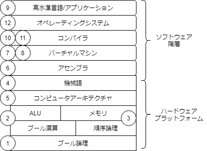

# 1章 ブール論理
- NandやAndといったゲートがどんなものなのかは分かった。
- 最適な論理設計にはできてないが、論理設計がこんな感じで行われているのは分かった。
- 次はこの論理設計したゲートがどう使われるのか意識する。
- また、論理設計の勘所みたいなのは全然分かってない。たぶん論理学とかやっているとかなりわかりやすかったと思う。
- この辺のことは
  - コンピュータアーキテクチャのエッセンス
  - 作ろうCPU
をやるともっと深まりそうな気配がある。

# 2章 ブール算術
- この辺のことは
  - コンピュータアーキテクチャのエッセンス
  - コンピュータの構成と設計 上
をやるともっと深まりそうな気配がある。 

# 3章 順序回路
- 1,2章で作ったのは組み合わせ回路と呼ぶ。
- 組み合わせ回路とは入力値によってのみ出力値が決まる回路のこと。
- これだとコンピュータは状態を保持することができない。状態を保持するための回路として順序回路を使う。
- 状態を保持する回路を記憶素子、メモリ回路とかって言う。
- メモリ回路はフリップフロップという回路から作っていくことができる。
- フリップフロップとクロックが分かるとメモリ回路を作っていくことができる。
- クロックとは低い電圧と高い電圧を一定の周期で回路に伝える信号のこと。
- フリップフロップとはinとout、クロック入力のインターフェイスがある。
- クロック入力ではクロックが常に送られてくる。これを利用してフリップフロップでは1つ前のタイムユニットの入力値を出力しているだけである。
- レジスタとはデータを格納したり呼び出したりすることができる記憶装置である。
- 多ビットレジスタが保持する値のことをワードと呼ぶ。
- メモリは任意の長さのワードを記憶する装置のこと。レジスタをたくさん積み重ねることで、RAMユニットを構築できる。RAM=Random Access Memoryはランダムに選ばれたワードに対してそのワードが位置する場所に制限を受けることなく、書き込み/読み込みができるという由来がある。つまり、メモリ中のすべてのワードは同じ時間で直接アクセスできなければならない。

# 4章 機械語
- 機械語とは機械を操作する言語のこと。これまで作った順序回路、論理回路を用いて作られたコンピュータを操作するための言語。
- 操作には以下が含まれる。
  - 算術演算
  - 論理演算
  - メモリからのフェッチ
  - メモリへのデータ保存
  - レジスタ間のデータ移動
  - ブーリアン値の条件テスト
- 機械語はハードウェア上で直接動作すること、ハードウェア全体を制御できることを求められる。
- 機械語 = バイナリコード
- アセンブリ言語 → アセンブラ → 機械語 → CPU → ハードウェア操作
- 

# 5章 コンピュータ・アーキテクチャ
- 内容はだいたい分かったが、CPUの実装で挫折した。
- 4章と5章を熟読する必要があり、めんどくさい。CPUを作ろう！とかCPUの創り方とか他の書籍でもコンピュータアーキテクチャに関連する話はしそうなので、その辺を読んだらまたやりたい。
- 内容としては以下をやった。今回はノイマン型コンピュータ、プログラム内蔵方式のコンピュータを実装してみようっていう話だった。
  - ノイマン型コンピュータ
  - 万能チューリングマシン
  - プログラム内蔵方式
 
 # 6章 アセンブラ
 - 

# メモ

